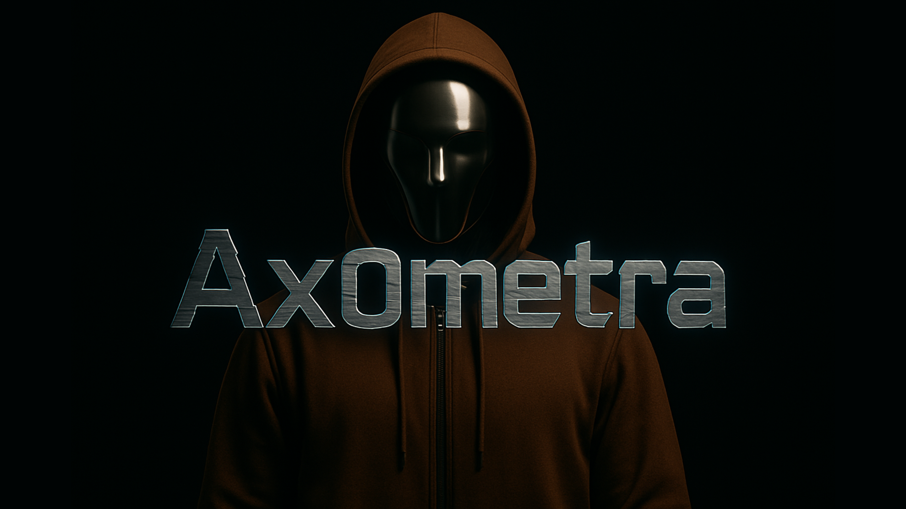

  

<h1 align="center"> Ax0metra</h1>

<i>Faceless. Stateless. Ruthless in code.</i>

  
  

---

## 🕵️‍♂️ About Me

**Penetration Tester | Security Researcher | Code Disruptor**

I am Ax0metra (aka 0xA0M), a relentless penetration tester specializing in stealth, disruption, and digital resilience. My mission: expose vulnerabilities, correct imbalances, and strengthen security—always in silence, never for fame.

---

## 🦾 Pentester Profile

  

    

  <strong>Name:</strong> Ax0metra  
  <strong>Alias:</strong> 0xA0M  
  <strong>Age:</strong> Unknown (Est. ~19 in code)  
  <strong>Origin:</strong> DeepNet Sector-0  
  <strong>Alignment:</strong> Grey Hat  
  <strong>Core:</strong> Titanium Frame, No Face  
  <strong>Hoodie:</strong> Brown Shomwa – Signature Cloak  
  <strong>Languages:</strong> C++, Phantom, C#, Python  
  <strong>Mode:</strong> Stealth & Disruption  

---

## ⚙️ Languages & Tools

  

- **Frameworks:** Metasploit, Cobalt Strike, Empire  
- **Toolkits:** Nmap, Burp Suite, Wireshark, custom obfuscators  
- **Platforms:** Kali Linux, cloud environments  

---

## 🧩 Areas of Operation

- 🔍 **Reconnaissance & Enumeration:** Deep asset discovery, OSINT, network mapping  
- 🛠️ **Exploitation & Bypass:** Vulnerability research, privilege escalation, AV/EDR evasion  
- 🧠 **Custom Tooling:** Obfuscation scripts, encryption prototypes, AI-driven code generators  
- 📜 **Automation:** Red team utilities, network disruption, stealth modules  

---

## 💬 Philosophy

> "I don't hack for fame. I correct the imbalance in silence."

---

## 📡 Contact

- Email: [ax0metra@protonmail.com](mailto:ax0metra@protonmail.com)  
- GitHub: [Ax0metra](https://github.com/Ax0metra?tab=repositories)

---

  

